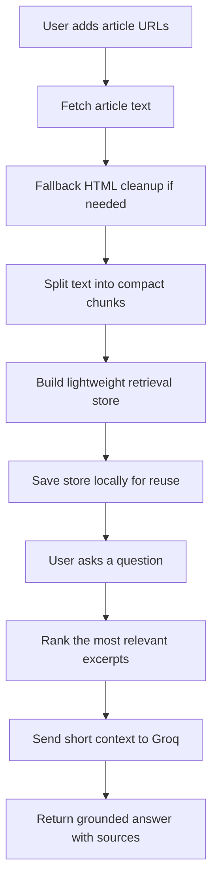

# Financial Knowledge Chatbot

An AI-powered Streamlit app for researching financial news with a clean, source-grounded workflow. Paste article URLs, process the sources, and ask questions with answers constrained to retrieved excerpts.

## Live Demo

- Deployed app: [financial-knowledge-chatbot.onrender.com](https://financial-knowledge-chatbot.onrender.com/)

## Overview

This project is designed to help users:

- extract article text from financial news URLs
- split content into smaller chunks for lightweight retrieval
- rank the most relevant excerpts with a memory-friendly search layer
- generate concise answers using Groq-hosted models
- keep responses grounded in the provided sources

## Why This Version

The current implementation is intentionally lightweight so it can run within a small deployment footprint. Compared with embedding-heavy approaches, it:

- uses less memory at startup
- avoids loading large vector models
- keeps retrieval simple and fast
- reduces the chance of deployment failures on smaller Render instances

## Tech Stack

- `Python`
- `Streamlit`
- `Groq API`
- `newspaper3k`
- `requests`
- `beautifulsoup4`
- `python-dotenv`
- `lxml_html_clean`

## How It Works



## Key Features

- URL ingestion from the sidebar or uploaded text files
- fallback HTML extraction when article parsing fails
- lightweight lexical retrieval to keep memory usage low
- optional local saved index loading
- Groq-based answer generation with strict grounding
- source expanders for quick verification

## Project Structure

- `main.py`: Main Streamlit application and retrieval pipeline.
- `requirements.txt`: Python dependencies.
- `.env.example`: Safe environment template for GitHub.
- `.env`: Your local secrets file, not committed.

## Setup For A Fresh Clone

### 1. Clone the repository

```bash
git clone https://github.com/AashishMLtech/Financial-knowledge-chatbot.git
cd Financial-knowledge-chatbot
```

### 2. Create and activate a virtual environment

Windows PowerShell:

```powershell
python -m venv .venv
.\.venv\Scripts\Activate.ps1
```

macOS/Linux:

```bash
python3 -m venv .venv
source .venv/bin/activate
```

### 3. Install dependencies

```bash
pip install --upgrade pip
pip install -r requirements.txt
```

### 4. Create your environment file

Copy the example file:

```bash
copy .env.example .env
```

Then update `.env` with your Groq API key:

```env
GROQ_API_KEY=your_groq_api_key_here
GROQ_MODEL=openai/gpt-oss-120b
```

If your account does not have access to that model, try:

```env
GROQ_MODEL=qwen/qwen3.6-27b
```

## Run Locally

```bash
streamlit run main.py
```

## Deploy On Render

Use this start command:

```bash
streamlit run main.py --server.port $PORT --server.address 0.0.0.0
```

Add these environment variables in Render:

```env
GROQ_API_KEY=your_groq_api_key_here
GROQ_MODEL=openai/gpt-oss-120b
```

## Usage

1. Open the app in your browser.
2. Add article URLs in the sidebar or upload a `.txt` file with one URL per line.
3. Click `Process sources`.
4. Ask a question in the main panel.
5. Review the answer and the supporting excerpts.

## Notes

- The assistant is instructed to answer only from retrieved excerpts.
- If the sources do not support an answer, it should refuse instead of guessing.
- Keep `.env` out of GitHub.
- The saved retrieval store is generated locally when you process sources.

## License

No license has been specified yet.
