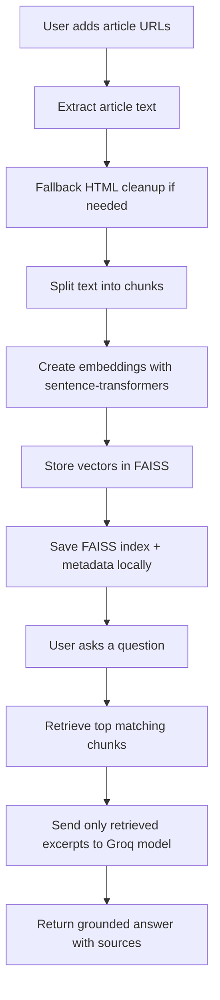

# Financial Knowledge Chatbot

A Streamlit app for financial news research. Add article URLs, build a retrieval index from the article text, and ask questions grounded only in the retrieved excerpts.

## What It Does

The app:

- extracts content from financial news URLs
- splits each article into smaller chunks
- creates local embeddings for semantic search
- stores the FAISS index on disk for reuse
- sends only the most relevant excerpts to a Groq-hosted model
- answers with citations and a strong no-hallucination instruction

## Tech Stack

- `Python`
- `Streamlit`
- `newspaper3k`
- `requests`
- `beautifulsoup4`
- `sentence-transformers`
- `FAISS`
- `Groq API`
- `python-dotenv`

## How The Flow Works



## Project Structure

- `main.py`: Main Streamlit application and retrieval pipeline.
- `requirements.txt`: Python dependencies.
- `.env.example`: Safe environment template for GitHub.
- `.env`: Your local secrets file, not committed.

## Setup For A Fresh Clone

### 1. Clone the repository

```bash
git clone https://github.com/AashishMLtech/Financial-knowledge-chatbot.git
cd <repo-folder>
```

### 2. Create and activate a virtual environment

Windows PowerShell:

```powershell
python -m venv .venv
.\.venv\Scripts\Activate.ps1
```

macOS/Linux:

```bash
python3 -m venv .venv
source .venv/bin/activate
```

### 3. Install dependencies

```bash
pip install --upgrade pip
pip install -r requirements.txt
```

### 4. Create your environment file

Copy the example file:

```bash
copy .env.example .env
```

Then update `.env` with your Groq API key:

```env
GROQ_API_KEY=your_groq_api_key_here
GROQ_MODEL=openai/gpt-oss-120b
```

If your account does not have access to that model, try:

```env
GROQ_MODEL=qwen/qwen3.6-27b
```

## Run The App

```bash
streamlit run main.py
```

## Usage

1. Open the app in your browser.
2. Add article URLs in the sidebar or upload a `.txt` file with one URL per line.
3. Click `Process sources`.
4. Ask a question in the main panel.
5. Review the answer and the supporting excerpts.

## Key Features

- URL ingestion from sidebar inputs or uploaded text files
- fallback HTML extraction when article parsing fails
- semantic retrieval using local embeddings
- persistent FAISS storage for faster reuse
- Groq-based answer generation with low temperature
- source expanders for easier verification

## Notes

- The assistant is instructed to answer only from retrieved excerpts.
- If the sources do not support an answer, it should refuse instead of guessing.
- Keep `.env` out of GitHub.
- The FAISS index files are generated locally when you process sources.
